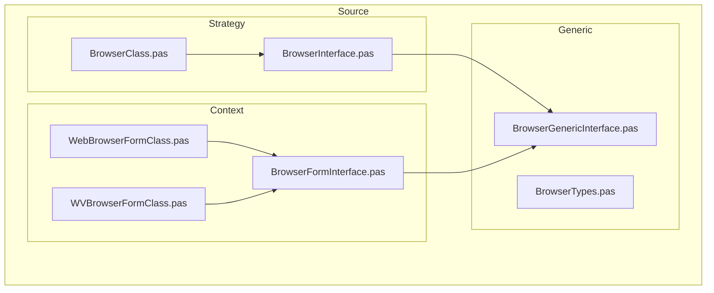
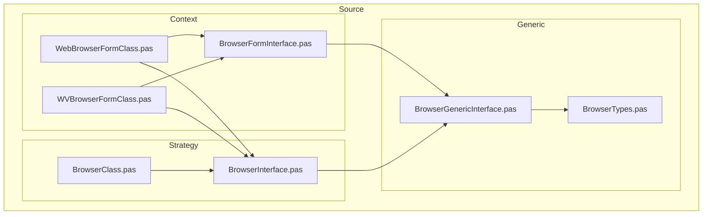

# Delphi Browser Framework

Este projeto em Delphi implementa um framework de abstração para navegadores ou formulários baseados em visualização Web, utilizando o padrão de projeto **Strategy** com suporte a **interfaces fluentes** e **encapsulamento de propriedades comuns**.

## ✨ Objetivo

Oferecer uma arquitetura extensível e reutilizável para formulários de navegador (`IBrowser` e `IBrowserForm`), com foco em:

- Configuração fluente (`method chaining`)
- Separação clara de responsabilidades
- Uso de interfaces para abstração e desacoplamento
- Propriedades e comportamentos reutilizáveis via interface base (`IBrowserGeneric`)

## 📦 Estrutura de Interfaces

### 🔹 IBrowserGeneric

Interface base com os métodos e propriedades comuns:

- `Width`, `Height`, `Caption`, `CaptionPosition`
- `ActionButtons`, `Resizable`, `Movable`

```pascal
type
  IBrowserGeneric = interface
    ...
  end;
````

### 🔹 IBrowser

Interface principal para navegadores personalizados.

```pascal
type
  IBrowser = interface(IBrowserGeneric)
    ...
  end;
```

### 🔹 IBrowserForm

Versão especializada da interface para integração com formulários Delphi.

```pascal
type
  IBrowserForm = interface(IBrowserGeneric)
    ...
  end;
```

## 🧩 Como usar

1. Implemente a interface `IBrowserForm` ou `IBrowser` em uma classe Delphi.
2. Use os métodos fluentes para configurar as propriedades antes de exibir o formulário:

```pascal
BrowserForm
  .SetWidth(800)
  .SetHeight(600)
  .SetCaption('Exemplo de Navegador')
  .SetResizable(True)
  .ShowModal;
```

## 📁 Organização do Projeto

```
/Source
  ├── Context
  │   ├── BrowserFormInterface.pas      // Interface IBrowserForm
  │   ├── WebBrowserFormClass.pas       // Implementação com TWebBrowser
  │   └── WVBrowserFormClass.pas        // Implementação com WebView2
  │
  ├── Generic
  │   ├── BrowserGenericInterface.pas   // Interface IBrowserSettings (genérica)
  │   └── BrowserTypes.pas              // Tipos auxiliares (TPositionCaption, TOpenType etc.)
  │
  └── Strategy
      ├── BrowserClass.pas              // Implementação da lógica de navegador
      └── BrowserInterface.pas          // Interface IBrowser
```

## 📁 Diagrama Mermaid

### 📁 Mermaid Graph TD



### 📁 Mermaid Flowchart TB



## 🔧 Requisitos

* Delphi 10.4+ (recomendado)
* VCL com suporte a `TBorderIcons`, `TPosition`, etc.

## 📄 Licença

Este projeto está licenciado sob a [MIT License](LICENSE).

---

Feito com 💻 por \[Nickson Jeanmerson]